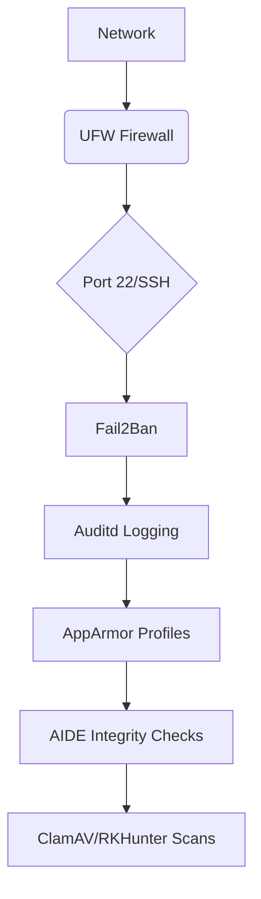

Here's a detailed explanation of the security and monitoring tools in your server setup script:

---

### **1. Core Security Tools**
**Fail2Ban**  
- **Purpose**: Intrusion prevention against brute-force attacks  
- **Function**: Monitors logs (SSH, web servers) and bans IPs with suspicious activity  
- **Config**: `/etc/fail2ban/jail.local`  
- **Key Benefit**: Reduces unauthorized access attempts automatically [1]

**ClamAV**  
- **Role**: Open-source antivirus engine  
- **Use Case**: Detects malware/trojans in files and emails  
- **Database**: Updated via `freshclam` (virus definition updates)  
- **Scan Command**: `clamscan -r / --exclude-dir=/sys` 

**RKHunter (Rootkit Hunter)**  
- **Function**: Scans for rootkits, backdoors, and local exploits  
- **Checks**:  
  - Hidden files  
  - Binary checksums  
  - Suspicious kernel modules  
- **Log**: `/var/log/rkhunter.log` 

---

### **2. System Hardening**
**AppArmor**  
- **Purpose**: Mandatory Access Control (MAC) system  
- **Function**: Restricts program capabilities via security profiles  
- **Commands**:  
  ```bash
  aa-status  # View enforcement status
  aa-enforce /path/to/profile  # Activate profile
  ```

**Auditd**  
- **Role**: System auditing daemon  
- **Tracks**:  
  - File accesses  
  - User logins  
  - Privilege escalations  
- **Logs**: `/var/log/audit/audit.log` 

**AIDE (Advanced Intrusion Detection Environment)**  
- **Function**: File integrity monitoring  
- **Workflow**:  
  1. `aideinit` creates baseline database  
  2. Regular checks compare against baseline  
  3. Alerts on unauthorized changes 

---

### **3. Automated Maintenance**
**Unattended-Upgrades**  
- **Purpose**: Automatic security updates  
- **Config**: `/etc/apt/apt.conf.d/50unattended-upgrades`  
- **Key Settings**:  
  ```conf
  Unattended-Upgrade::Allowed-Origins {
      "${distro_id}:${distro_cod}-security";
  };
  Update-Package-Lists "1";
  Automatic-Reboot "true"; 
  ```

---

### **4. Monitoring & Observability**
**Netdata**  
- **Capabilities**: Real-time metrics for:  
  - CPU/RAM usage  
  - Disk I/O  
  - Network traffic  
  - Running processes  
- **Access**: `http://<server-ip>:19999`  
- **Benefits**: <1s latency metrics, prebuilt dashboards 

**Caddy**  
- **Role**: Modern web server/reverse proxy  
- **Features**:  
  - Automatic HTTPS via Let's Encrypt  
  - HTTP/3 support  
  - Simple config syntax (`Caddyfile`)  
- **Use Case**: Secure frontend for web apps 

**Certbot**  
- **Purpose**: Automates SSL certificate management  
- **Common Use**:  
  ```bash
  certbot --nginx -d example.com  # Get/renew certificates
  ```

---

### **5. Core System Utilities**
| Tool | Purpose | Key Features |
|------|---------|--------------|
| **htop** | Process monitor | Color-coded resource usage |
| **iotop** | Disk I/O monitor | Per-process read/write stats |
| **iftop** | Network traffic | Bandwidth usage by connection |
| **tmux** | Terminal multiplexer | Persistent sessions, split panes |

---

### **Security Architecture**


---

### **Key Takeaways**
1. **Defense-in-Depth**: Layered security from firewall (UFW) to file integrity (AIDE)  
2. **Compliance**: Auditd helps meet regulatory requirements (HIPAA, PCI-DSS)  
3. **Proactive Monitoring**: Netdata enables real-time anomaly detection  
4. **Maintenance Automation**: Unattended updates reduce patching delays  

For production environments, consider adding:
- Centralized logging (ELK Stack/Grafana Loki)  
- IDS/IPS (Suricata/Snort)  
- Container runtime protection (Falco)

Citations:
[1] https://ppl-ai-file-upload.s3.amazonaws.com/web/direct-files/50071645/5cec9489-1df2-4711-be59-3809436613cd/paste.txt
